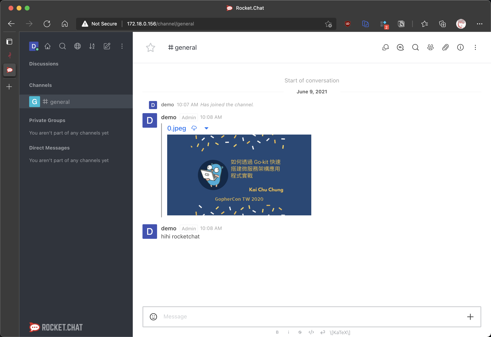
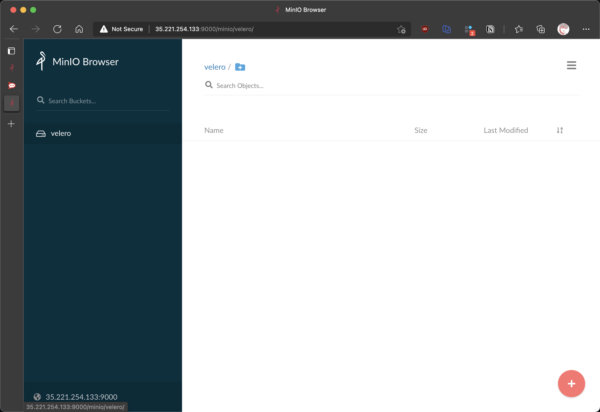

<!--more-->

[Velero](https://velero.io/) 是一個開源的 Kubernetes 集群備份和遷移工具 (2019 年初 VMware 完成了對於容器技術廠商 Heptio 的收購後更名為 Velero, 其中的冷知識故事可以至 [關於 Heptio 你需要知道的 - VMware 繁體中文部落格](https://blogs.vmware.com/vmware-taiwan/2019/03/01/%E9%97%9C%E6%96%BC-heptio-%E4%BD%A0%E9%9C%80%E8%A6%81%E7%9F%A5%E9%81%93%E7%9A%84/) 閱讀)

## What is [Velero](https://velero.io/docs/v1.6/index.html)?

Velero is an open source tool to safely backup and restore,
perform disaster recovery, and migrate Kubernetes cluster
resources and persistent volumes

Aiming to help with:
- Disaster Recovery: Recover from an issue
- Data Migration: Migrate apps between clusters
- Data Protection: Scheduled Actions

### backup process


1. Velero 的基本操作就是 CLI 會去操作 Kubernetes API 建立 `Backup` 物件
1. `BackupController` 偵測到新的 `Backup` 物件並檢查
1. 檢查通過後就會操作 Kubernetes API Server 進行資料的備份
1. `BackupController` 就會透過 Plugin 會操作對應用 Object Storage Service 上傳檔案
1. 如果 Provider 支援原生的快照操作, Plugin 就可以透過 API 備分永久磁碟區

## Questions?

圍繞這個備份流程就會衍申很多細節出來，讓我們慢慢的疏理

- [集群備份到底包含了什麼東西?](#集群備份到底包含了什麼東西)
- [集群復原到底包含了什麼東西?](#集群復原到底包含了什麼東西)
- [集群遷移可以跨 Cloud provider 嗎?](#集群遷移可以跨-cloud-provider-嗎)

### 集群備份到底包含了什麼東西?

```bash
backups.velero.io
backupstoragelocations.velero.io
deletebackuprequests.velero.io
downloadrequests.velero.io
podvolumebackups.velero.io
podvolumerestores.velero.io
resticrepositories.velero.io
restores.velero.io
schedules.velero.io
serverstatusrequests.velero.io
volumesnapshotlocations.velero.io
```

Velero 所定義的 CRD (Custom Resource Definitions) 來看

- `backups.velero.io` 備份是一種 Velero 資源，表示在某個時間點（API 物件和關聯的磁碟區狀態）捕獲 Kubernetes 集群狀態
- 對應備份的就是 `restores.velero.io`，恢復也是一種 Velero 資源，代表從 Velero 備份到目標 Kubernetes 集群的資源應用。
- `backupstoragelocations.velero.io` & `volumesnapshotlocations.velero.io` 則是 Velero 儲存備份物件的位置及 Velero 磁碟區快照的位置
- `schedules.velero.io` 表示應該運行的預調度或定期備份
- `serverstatusrequests.velero.io` 是訪問有關 Velero 服務器的當前狀態信息的請求
- `downloadrequests.velero.io` 是從備份物件儲存下載工件的請求，例如備份日誌文件。

備份的分類就 CRD 來看可以分成二塊
- 一個是 Kubernetes 集群範圍內的資源(pod, service, secret, etc.)
- 另一個就是磁碟區快照 (預設 Velero 會對任何的永久磁碟區進行磁碟快照，如果 Provider 有原生支援磁碟區快照的話就會透過 Plugin 進行 API 的操作，如果沒有原生支援磁碟區快照時可以啟用 `Restic` 一起使用，當然 `Restic` 也是有一些[限制](https://velero.io/docs/v1.6/restic/#limitations), `hostPath` 類型的磁碟區就沒有支原，不過 [Local persistent volumes](https://kubernetes.io/docs/concepts/storage/volumes/#local) 是有的，在本地 K8s 集群測試時就可以選用，只是需要手動配置 PV)

```bash
velero backup describe rocketchat-backup --details
...

Resource List:
  apps/v1/ControllerRevision:
    - rocketchat/rocketchat-mongodb-arbiter-6d98cfbb59
    - rocketchat/rocketchat-mongodb-primary-6fd77d9dd9
    - rocketchat/rocketchat-mongodb-secondary-7cd46b58bf
  apps/v1/Deployment:
    - rocketchat/rocketchat-rocketchat
  ...
  v1/ServiceAccount:
    - rocketchat/default
    - rocketchat/rocketchat-rocketchat

Velero-Native Snapshots: <none included>

Restic Backups:
  Completed:
    rocketchat/rocketchat-mongodb-primary-0: datadir
```

當備份完成之後我可以用查看備份的詳細資訊，除了 Kubernetes 資源的備份之外，最重要的就是 `Restic Backups`，列出來相關 Pod 的磁碟區備份的狀態

1. Velero 適合無狀態的 Workload，如果是有狀態的 Workload 可以搭配 Restic 來進行備份及復原

如果沒有跨 Provider 的需求且 Provider 有支援原生磁碟區快照，使用 Velero + Velero-Native Snapshots 就可以了

1. 安裝 Velero 預設沒有啟用 Restic，需要特別指定, 備份碟碟區也需要手動指定. 另一種方法是使用 `--default-volumes-to-restic` 備份所有 Pod 的磁碟區
1. 備份時可以使用 [Resource filtering](https://velero.io/docs/v1.6/resource-filtering/) 正面表列或是負面表例來過濾目標物件 (如: namespace, deployments 等等)
1. 備份也可提供了 [Pre Hooks](https://velero.io/docs/v1.6/backup-hooks/#pre-hooks) 及 [Post Hooks](https://velero.io/docs/v1.6/backup-hooks/#post-hooks) 的功能，例如 pre 及 post Hooks 中凍結檔案系統來確保 ....
1. 雖說我們可以使用 Restic 來備份磁碟區，`hostpath` 的儲存類型是不支援的，而本地磁碟區(Local Persistent Volume) 是可以的，所以本地測試的 Kubernetes 需要手動配置本地磁碟區使用 Restic 備份才有效

### 集群復原到底包含了什麼東西?

當我們完成了備份可以使用 Velero 指令或是 Velero CRDs 查檢查一下備份的訊息

``` bash
$ velero backup get
NAME                STATUS      ERRORS   WARNINGS   CREATED                         EXPIRES   STORAGE LOCATION   SELECTOR
rocketchat-backup   Completed   0        0          2021-06-07 15:43:15 +0800 CST   29d       default            <none>
```

```bash
$ kubectl get backups.velero.io -n velero
NAME                AGE
rocketchat-backup   17h
```

1. 我們可以 [Restoring Into a Different Namespace](https://velero.io/docs/v1.6/restore-reference/#restoring-into-a-different-namespace) 將我們的備份復原至另一個 namespace
1. 復原也是可以使用 [Resource filtering](https://velero.io/docs/v1.6/resource-filtering/) 正面表列或是負面表例來過濾目標物件 (如: namespace, deployments 等等) 指定所需的資源進行復原
1. 復原時更改儲存類別的對應 [Changing PV/PVC Storage Classes](https://velero.io/docs/v1.6/restore-reference/#changing-pvpvc-storage-classes#changing-pvpvc-storage-classes)，例如在本地 Kind Kubernetes 的儲存類別為 `local-storage` 對到 `standard` (Cloud Provider 有支援永久磁碟區動態佈建預設類別)
1. 復原也跟備份一樣提供 Hooks。 [InitContainer Restore Hooks](https://velero.io/docs/v1.6/restore-hooks/#initcontainer-restore-hooks#initcontainer-restore-hooks) 及 [Exec Restore Hooks](https://velero.io/docs/v1.6/restore-hooks/#initcontainer-restore-hooks#exec-restore-hooks)

### 集群遷移可以跨 Cloud provider 嗎?


基本上是可以的. 可以使用 Velero + Restic 來完成


接下來就示範在本地 Kind Kuberntes 部署 [rocketchat](https://github.com/helm/charts/tree/master/stable/rocketchat)，透過 Velero 及 Restic 將 Workload 遷移至 GKE

簡單的流程如下:
1. 在本地 Kind Kubernetes 中配置儲存類別為 `local-storage` 的本地永久磁碟區 (Local Persistent Volume)
1. 在本地 Kind Kubernetes 中建立 [rocketchat](https://github.com/helm/charts/tree/master/stable/rocketchat) 有狀態的 Workload
1. 在本地 Kind Kubernetes 中建立 Minio server
1. 透過 Velero 及 Restic 備份相關 Kubernetes 資源及久永磁碟區(Local Persistent Volume) 至 Kind Kubernetes 中的 Minio S3 Bucket
1. 使用 `s3cmd` 將 Kind Kubernetes 中的 `s3://velero/backups/` `s3://velero/restic/` 下載到本地電腦 `backup` 目錄
1. 在 GKE 上建立一個 Kubernetes 集群
1. 在 GKE 上安裝 Veleor 及 Restic 設定
1. 使用 `s3cmd` 將 `backup` 目錄上傳至 GKE Kubernetes 集群中 minio S3 bucket
1. 設置 `change-storage-class-config` 來指定儲存類型的轉換
1. 使用 Velero 復原 rocketchat workload
1. 等待 Workload 就緒

## 跨 Provider 集群遷移 Demo

### 集群遷移的概念

graph LR
  subgraph Local Desktop
    a[Backup]
  end

  subgraph KIND Cluster
    r1[Rocketchat]-.Velero Backup.->c1[(Minio Server<br/>s3://velero)]
  end

  subgraph GKE Cluster
    c2[(Minio Server<br/>s3://velero)]-.Velero Restore.->r2[Rocketchat]
  end

  c1--s3cmd sync-->a
  a--s3cmd sync-->c2


在需要本地 KIND 集群及目標集群 GKE 上都裝上 Velero + Minio Server
1. 使用 Velero + Restic 在本地 KIND 集群執行備份操作，並將備份儲存至集群內部的 Minio Server
1. 使用 `s3cmd` 同步本地 KIND 集群 Minio Server 中的 `s3://velero` Bucket 至本機 `backup`
1. 使用 `s3cmd` 將本機 `backup` 同步至目標集群 GKE 上 Minio Server `s3://velero` Bucket
1. 使用 Velero + Restic 回復 Workload

### 注意事項
- 為了簡化部署 Minio Server 及 Velero 的方式及資源，使用 helm + 減少 `cpu/memory` 的請求 size
- [vmware-tanzu/helm-charts: Contains Helm charts for Kubernetes related open source tools](https://github.com/vmware-tanzu/helm-charts)
- [Helm Charts to deploy Bitnami Object Storage based on MinIO(R) in Kubernetes](https://bitnami.com/stack/minio/helm)
- 使用 [s3tools/s3cmd](https://github.com/s3tools/s3cmd) 來同步備份使用的 Bucket

### 操作步骤

#### 在本地 KIND 集群進行備份

1. 在本地建立 KIND 集群
    ```bash
    cat <<EOF > kind-config.yaml
    kind: Cluster
    apiVersion: kind.x-k8s.io/v1alpha4
    nodes:
    - role: control-plane
      # add a mount from /path/to/my/files on the host to /files on the node
      extraMounts:
      - hostPath: /tmp/mnt_disks/
        containerPath: /mnt/disks
    EOF

    kind create cluster --name rocketchat-migrate-demo --config kind-config.yaml
    ```
1. 配置 `metallb` local Balancer
    ```bash
    kubectl apply -f https://raw.githubusercontent.com/metallb/metallb/v0.9.6/manifests/namespace.yaml
    kubectl create secret generic -n metallb-system memberlist --from-literal=secretkey="$(openssl rand -base64 128)"
    kubectl apply -f https://raw.githubusercontent.com/metallb/metallb/v0.9.6/manifests/metallb.yaml

    cat <<EOF > metallb-config.yaml
    apiVersion: v1
    kind: ConfigMap
    metadata:
      namespace: metallb-system
      name: config
    data:
      config: |
        address-pools:
        - name: default
          protocol: layer2
          addresses:
          - 172.18.0.155-172.18.0.200
    EOF

    kubectl apply -f ./metallb-config.yaml
    ```
1. 配置 `rocketchat-migrate-demo-control-plane` 的磁碟區掛載
    - 連線至 `rocketchat-migrate-demo-control-plane` node
      ```bash
      docker exec -it rocketchat-migrate-demo-control-plane bash
      ```
    - 在 `rocketchat-migrate-demo-control-plane` node 建立後序所需的磁碟區
      ```bash
      for vol in pv1; do mkdir /mnt/disks/$vol; mount -t tmpfs $vol /mnt/disks/$vol; done
      ```
1. 建立 `local-storage` 儲存類別
    ```bash
    cat <<EOF > local-pv-storage.yaml
    apiVersion: storage.k8s.io/v1
    kind: StorageClass
    metadata:
      name: local-storage
    provisioner: kubernetes.io/no-provisioner
    volumeBindingMode: WaitForFirstConsumer
    EOF

    kubectl apply -f local-pv-storage.yaml
    ```
1. 手動建立本地久永磁碟區 `local-persistent-storage`
    ```bash
    cat <<EOF > local-pv.yaml
    kind: PersistentVolume
    apiVersion: v1
    metadata:
      name: local-persistent-storage
      namespace: rocketchat
      labels:
        type: local
    spec:
      capacity:
        storage: 200Mi
      volumeMode: Filesystem
      accessModes:
      - ReadWriteOnce
      persistentVolumeReclaimPolicy: Delete
      storageClassName: local-storage
      local:
        path: /mnt/disks/pv1
      nodeAffinity:
        required:
          nodeSelectorTerms:
          - matchExpressions:
            - key: kubernetes.io/hostname
              operator: In
              values:
              - rocketchat-migrate-demo-control-plane
    EOF

    kubectl apply -f local-pv.yaml
    ```
1. 建立 Minio Server
    ```bash
    cat <<EOF > minio-values.yaml
    global:
      minio:
        accessKey: minio
        secretKey: minio123

    service:
      type: LoadBalancer

    defaultBuckets: velero

    persistence:
      size: 1G
    EOF

    helm install minio --create-namespace --namespace minio -f minio-values.yaml bitnami/minio
    ```

    

1. 建立 Demo rocketchat 應用，直接使用 helm 來部署，在 `storageClass` 中指定我們自定義的 `local-storage`
    ```bash
    cat <<EOF > rocketchat.yaml
    persistence:
      enabled: true
    service:
      type: LoadBalancer
    mongodb:
      mongodbPassword: password
      mongodbRootPassword: password
      persistence:
        storageClass: local-storage
        size: 200Mi
    EOF

    helm install rocketchat --namespace rocketchat --create-namespace -f rocketchat.yaml stable/rocketchat
    ```
 
    

    等待 Workload 就序之，經過初始化的設定，就可以開始使用，我們在 Channel `#general` 中新增一張圖還有一些文字

1. 建立 Velero，我們一定使用 helm 來簡化部署的流程。在設定檔中指定了 Minio Server 相關的設定，啟用 Restic，還有為了 Demo 減少了 cpu/memory 的請求 Size
    > helm repo add vmware-tanzu https://vmware-tanzu.github.io/helm-chartsk
    ```bash
    MINIO_SVC=$(kubectl -n minio get svc minio -o=jsonpath="{.status.loadBalancer.ingress[0].ip}")
    PUBLIC_URL=http://$MINIO_SVC:9000

    cat <<EOF > velero-values.yaml
    configuration:
      provider: aws
      backupStorageLocation:
        bucket: velero
        config:
          region: default
          s3ForcePathStyle: true
          publicUrl: $PUBLIC_URL
          s3Url: http://minio.minio.svc.cluster.local:9000
      volumeSnapshotLocation:
        config:
          region: default
    credentials:
      useSecret: true
      secretContents:
        cloud: |
          [default]
          aws_access_key_id = minio
          aws_secret_access_key = minio123
    configMaps:
      restic-restore-action-config:
        labels:
          velero.io/plugin-config: ""
          velero.io/restic: RestoreItemAction
        data:
          image: velero/velero-restic-restore-helper:v1.6.0
    deployRestic: true
    restic:
      resources:
        requests:
          cpu: 250m
          memory: 256Mi
        limits:
          cpu: 500m
          memory: 512Mi
    resources:
      requests:
        cpu: 250m
        memory: 128Mi
      limits:
        cpu: 500m
        memory: 512Mi
    initContainers:
      - name: velero-plugin-for-aws
        image: velero/velero-plugin-for-aws:v1.1.0
        imagePullPolicy: IfNotPresent
        volumeMounts:
          - mountPath: /target
            name: plugins
    EOF

    helm install velero vmware-tanzu/velero --namespace velero --create-namespace -f velero-values.yaml
    ```
1. 使用 Velero + Restic 備份 Rocketchat，需要手動指定 mongodb 所在 Pod 對應的永久磁碟區的名子 `datadir`
    我們先找出 rocketchat 的永久磁碟區
    ```bash
    $ kubectl get pvc -n rocketchat
    NAME                                   STATUS   VOLUME                                     CAPACITY   ACCESS MODES   STORAGECLASS    AGE
    datadir-rocketchat-mongodb-primary-0   Bound    local-persistent-storage                   200Mi      RWO            local-storage   61m
    rocketchat-rocketchat                  Bound    pvc-68f26e06-bf59-4310-8b7c-f5d8f21cb6eb   8Gi        RWO            standard        61m
    ```
    第一個名子 `datadir` 就是對應 Pod `rocketchat-mongodb-primary-0` 的磁碟區名子。使用 `kubectl` annotate 的方式來為 mongodb Pod 加註 metadata `backup.velero.io/backup-volumes=datadir`
    ```bash
    $ kubectl annotate pod -n rocketchat --selector=release=rocketchat,app=mongodb backup.velero.io/backup-volumes=datadir --overwrite
    pod/rocketchat-mongodb-primary-0 annotated

    $ kubectl -n rocketchat describe po rocketchat-mongodb-primary-0 | grep Annotations
    Annotations:  backup.velero.io/backup-volumes: datadir
    ```
1. 現在就可以使用 `velero backup` 的指令來進行備份動作並指定目際的 namespaces `rocketchat`
    ```bash
    velero backup create rocketchat-backup --include-namespaces rocketchat
    ```

    等待備份狀況變成 `Completed` 之後，我們可以使用 `velero backup describe rocketchat-backup --details` 來查看 Restic 是否有備份到我們聲名的 `datadir` 磁碟區

    ```
    Restic Backups:
      Completed:
        rocketchat/rocketchat-mongodb-primary-0: datadir
    ```

    這時候我們可以在 Minio Server 中 `velero/backups` 看到我們備份的相關文件 

    
1. 使用 `s3cmd` 將 KIND 集群的 Velero + Restic 備份檔下載到本機電腦 `backup` 目錄
    ```bash
    cat <<EOF > ~/.s3cfg
    host_base = 172.18.0.155:9000
    host_bucket = 172.18.0.155:9000
    bucket_location = default
    use_https = False
    access_key =  minio
    secret_key = minio123
    signature_v2 = False
    EOF

    mkdir backup
    s3cmd -p sync s3://velero/ backup/
    ```
#### 在 GKE 上建立新的 K8s 集群並復原 Workload

1. 到 GKE 上面建立一個新的 K8s 集群，用來復原我們 Velero + Restic 備份的目標集群
1. 等待 GKE k8s 集群就緒之後，我們也需要部署一份 Minio Server 及 Velero 相關設定
1. 可以重復使用 KIND 集群部署 Minio 相關的參數, GKE 對配發一個對外 IP 給 Minio Server 用
    ```bash
    helm install minio --create-namespace --namespace minio -f minio-values.yaml bitnami/minio
    ```
    
1. 部署 Velero 及 Restic，可以重新使用稍早建立 KIND 集群用的 `velero-values.yaml`
    ```bash
    MINIO_SVC=$(kubectl -n minio get svc minio -o=jsonpath="{.status.loadBalancer.ingress[0].ip}")
    PUBLIC_URL=http://$MINIO_SVC:9000
    echo $PUBLIC_URL
    helm install velero vmware-tanzu/velero \
      --namespace velero \
      --create-namespace \
      --set configuration.backupStorageLocation.config.publicUrl=$PUBLIC_URL \
      -f velero-values.yaml
    ```
1. 使用 `s3cmd` 將本機電腦 `backup` 下的檔案同步至 GKE Minio Server 中
    ```
    MINIO_SVC=$(kubectl -n minio get svc minio -o=jsonpath="{.status.loadBalancer.ingress[0].ip}")
    cat <<EOF > ~/.s3cfg
    host_base = $MINIO_SVC:9000
    host_bucket = $MINIO_SVC:9000
    bucket_location = default
    use_https = False
    access_key =  minio
    secret_key = minio123
    signature_v2 = False
    EOF

    s3cmd -p sync backup/ s3://velero/
    ```

    

    同步完之後可以在 GKE Minio Sever 中看到如同 KIND Minio Server 一樣的資料。   這時候我使用 Velero 來查看備份檔是否正常

    ```bash
    $ velero backup get
    NAME                STATUS      ERRORS   WARNINGS   CREATED                         EXPIRES   STORAGE LOCATION   SELECTOR
    rocketchat-backup   Completed   0        0          2021-06-08 15:00:12 +0800 CST   29d       default            <none>
    ```
1. 配置之前提到的 [Changing PV/PVC Storage Classes](https://velero.io/docs/v1.6/restore-reference/#changing-pvpvc-storage-classes#changing-pvpvc-storage-classes)，這一個步驟非常重要，因為我們受限本地 KIND k8s 集群 `hostpath` 類型的儲存類別是無法備份永久磁碟區，所以我們定義了一個 `local-storage` 儲存類別的本地永久磁碟區。而 GKE 是有支援永久磁碟區動態佈建的功能，不過預設的名子是 `default`，所以我就透過 Veleor 提供 Changing PV/PVC Storage Classes 的功能來進行對應

    ```bash
    cat <<EOF > change-storage-class-config.yaml
    apiVersion: v1
    kind: ConfigMap
    metadata:
      # any name can be used; Velero uses the labels (below)
      # to identify it rather than the name
      name: change-storage-class-config
      # must be in the velero namespace
      namespace: velero
      # the below labels should be used verbatim in your
      # ConfigMap.
      labels:
        # this value-less label identifies the ConfigMap as
        # config for a plugin (i.e. the built-in restore item action plugin)
        velero.io/plugin-config: ""
        # this label identifies the name and kind of plugin
        # that this ConfigMap is for.
        velero.io/change-storage-class: RestoreItemAction
    data:
      # add 1+ key-value pairs here, where the key is the old
      # storage class name and the value is the new storage
      # class name.
      local-storage: standard
    EOF

    kubectl apply -f change-storage-class-config.yaml -n velero
    ```
1. 確認了 Velero 備份及復原儲存類別的對應，就可以使用 Veleor 指定來復原 Rocketchat Workload
    ```bash
    velero restore create --from-backup rocketchat-backup
    ```
    檢查復原的狀態
    ```bash
    $ velero restore describe rocketchat-backup-20210609104124 --details
    Name:         rocketchat-backup-20210609104124
    Namespace:    velero
    Labels:       <none>
    Annotations:  <none>

    Phase:                       PartiallyFailed (run 'velero restore logs rocketchat-backup-20210609104124' for more information)
    Total items to be restored:  34
    Items restored:              34

    Started:    2021-06-09 10:41:24 +0800 CST
    Completed:  2021-06-09 10:41:58 +0800 CST

    Warnings:
      Velero:     <none>
      Cluster:    <none>
      Namespaces:
        rocketchat:  could not restore, configmaps "kube-root-ca.crt" already exists. Warning: the in-cluster version is different than the backed-up version.

    Errors:
      Velero:     <none>
      Cluster:    <none>
      Namespaces:
        rocketchat:  error restoring endpointslices.discovery.k8s.io/rocketchat/rocketchat-mongodb-85nhd: the server could not find the requested resource
                    error restoring endpointslices.discovery.k8s.io/rocketchat/rocketchat-mongodb-headless-2cbsv: the server could not find the requested resource
                    error restoring endpointslices.discovery.k8s.io/rocketchat/rocketchat-rocketchat-d8wxn: the server could not find the requested resource
                    error restoring poddisruptionbudgets.policy/rocketchat/rocketchat-mongodb-arbiter: the server could not find the requested resource
                    error restoring poddisruptionbudgets.policy/rocketchat/rocketchat-mongodb-secondary: the server could not find the requested resource

    Backup:  rocketchat-backup

    Namespaces:
      Included:  all namespaces found in the backup
      Excluded:  <none>

    Resources:
      Included:        *
      Excluded:        nodes, events, events.events.k8s.io, backups.velero.io, restores.velero.io, resticrepositories.velero.io
      Cluster-scoped:  auto

    Namespace mappings:  <none>

    Label selector:  <none>

    Restore PVs:  auto

    Restic Restores:
      Completed:
        rocketchat/rocketchat-mongodb-primary-0: datadir

    Preserve Service NodePorts:  auto
    ```

    這個我們遇到了一些 rocketchat 資源找不到的錯誤，不過我們透過 Resric 備份的 `datadir` 磁碟區有成功被復原

    

## 心得

文篇文章算是研究 Velero 的一些心得，及使用 Velero + Restic 進行跨 Provider 遷移集群的原理、注意事項及操作的過程，成功的將 Mac 本地的 KIND k8s 中的 Rocketchat workload 無縫的遷移到 GKE 中，中間的過程還算是簡單方便(如果沒有跨 Provider 有 Cloud Provider 的原生支援會更快速)，算是一個開源友好的集群遷移工具，不過魔鬼總是藏在細節中，官方文件最好是好好的看一看，要了解其中的限制

完整的 Demo code repo https://github.com/cage1016/velero-research-practice-demo